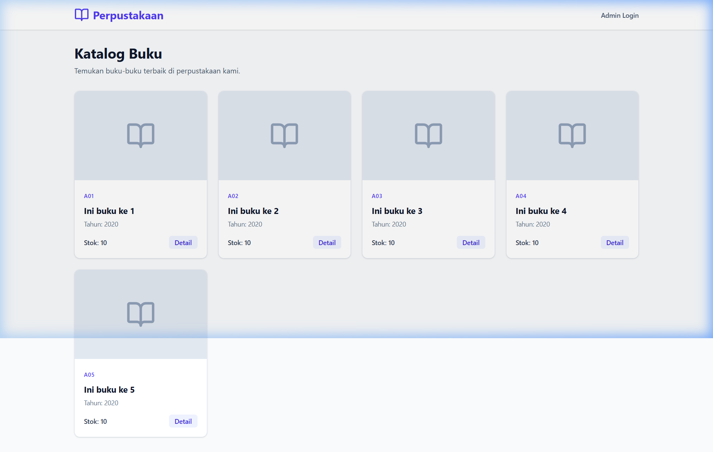

# 📚 Frontend UI - Sistem Informasi Perpustakaan (Mockup & Plan)

Halo! Ini adalah rancangan dan penjelasan implementasi buat frontend dari
RESTful API Perpustakaan yang udah dibuat pakai Golang (Hexagonal Architecture).

Karena API-nya lumayan kompleks (ada modul Auth, Buku, Penulis, Peminjaman,
dll), di sini gue jabarin pendekatan gimana cara ngebangun frontend-nya biar
rapi, gampang di-maintain, dan _user-friendly_.

## 🛠️ Teknologi yang Digunakan (Tech Stack)

Biar _development_-nya cepet tapi tetep _scalable_, ini stack yang
direkomendasikan:

- **Framework:** **React (pakai Vite)** ⚡. Kenapa Vite? Jauh lebih cepet buat
  _hot-reload_ dibanding Create React App biasa, dan ekosistem React itu paling
  cocok buat bikin _dashboard_ yang interaktif.
- **Styling:** **Tailwind CSS** 🎨 + **Shadcn UI**. Kombinasi maut buat bikin UI
  yang modern, _clean_, dan gampang disesuaikan tanpa harus nulis CSS dari nol.
- **State Management & Data Fetching:** **TanStack Query (React Query)** 🔄.
  Karena ini banyak main operasi CRUD (Buku, Penulis, Denda), React Query bakal
  ngebantu banget buat _caching_ data, ngatur _loading state_, dan _error
  handling_ tanpa perlu bikin banyak `useState`.
- **Routing:** **React Router DOM** 📍. Buat ngatur perpindahan halaman (misal
  dari halaman publik ke _dashboard_ admin).
- **HTTP Client:** **Axios** 🌐. Bakal kepakai banget buat bikin _interceptor_
  JWT. Jadi tiap _request_ ke _endpoint_ `/admin/*`, token bakal diselipin
  otomatis di _header_.

## 🏗️ Struktur Halaman (Page Structure)

Aplikasi bakal dibagi jadi 2 area utama: **Public Area** (bisa diakses siapa
aja) dan **Protected/Admin Area** (harus _login_ dulu).

### 1. Area Publik 🌍

- **`/` (Home / Katalog Buku):** Nampilin _list_ buku yang tersedia (ngambil
  dari _endpoint_ `GET /api/v1/buku`).
- **`/buku/:id` (Detail Buku):** Kalau buku di-klik, masuk ke halaman detail
  yang nampilin info stok, rak, penulis, dan penerbit.
- **`/login` (Login Page):** Form buat petugas/admin masuk ke sistem. Kalau
  _login_ sukses, token JWT bakal disimpen (bisa di _localStorage_ atau
  HTTP-only _cookie_).

### 2. Area Admin / Petugas 🔒 (Protected Routes)

Semua halaman ini ada di dalam _layout dashboard_ (punya _sidebar_ & _navbar_).

- **`/admin/dashboard`:** Halaman utama setelah _login_. Bisa diisi _summary_
  (misal: total buku, total denda belum dibayar).
- **`/admin/master-buku`:**
  - **Jenis Buku:** _Table view_ buat CRUD Kategori/Jenis Buku.
  - **Penulis Buku:** _Table view_ buat CRUD data penulis.
  - **Penerbit Buku:** _Table view_ buat CRUD data penerbit.
- **`/admin/transaksi`:**
  - **Peminjaman:** Nampilin daftar peminjaman, fitur tambah peminjaman baru
    (milih _dropdown_ anggota & buku), dan update status pengembalian.
  - **Denda:** Nampilin daftar denda kalau ada telat balik buku.

## 🧠 Pendekatan Implementasi

Biar _coding_-nya nggak berantakan, kita pakai struktur _folder_ yang
_feature-based_:

1. **Setup & Konfigurasi Auth:** Pertama, bikin _Axios Interceptor_. Tujuannya
   biar setiap _request_ yang butuh akses ke URL `/admin/*` otomatis bawa token
   Bearer. Kalau token-nya _expired_ (dapet _response_ 401), sistem bakal
   langsung nge-_redirect_ user ke halaman `/login`.
2. **Pembuatan UI Components:** Sebelum masuk ke logika API, kita rapihin dulu
   komponen UI _reusable_-nya (kaya _Button_, _Modal_, _Table_, _Input_ form).
   _Shadcn UI_ sangat bantu di fase ini.
3. **Integrasi React Query (API calls):** Kita bikin _custom hooks_ buat tiap
   entitas. Misalnya `useBuku()`, `usePenulis()`, `usePeminjaman()`. Jadi di
   dalam komponen React, kodenya bersih cuma tinggal manggil _hook_ tersebut.
4. **Handling Modul Peminjaman & Denda (Paling Krusial):** Saat bikin _form_
   peminjaman, kita bakal pakai _combo-box_ (dari UI library) buat milih ID
   Anggota dan ID Buku biar admin gampang nyarinya (nggak ngetik manual). Terus
   di-hit ke API `POST /admin/peminjaman/create`.

## 📸 Mockup / Desain Tampilan (Preview)

Ini gambaran (_mockup_) kira-kira gimana tampilan _dashboard_ adminnya nanti.
Desainnya dibikin modern, _sleek_, dengan _sidebar_ yang ngemudahin navigasi
antar modul CRUD.

_(Konsep UI: Dark/Light mode support, tabel data yang responsif, dan layout
glassmorphism yang kekinian)._

---
